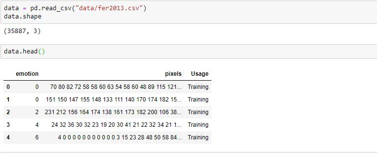
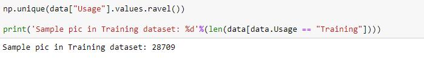
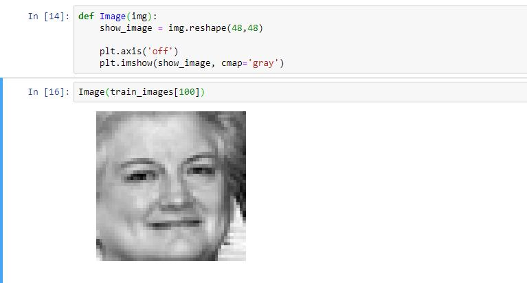
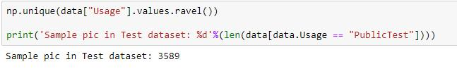
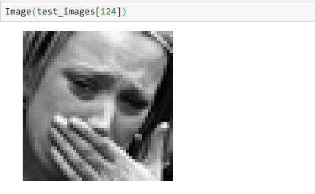
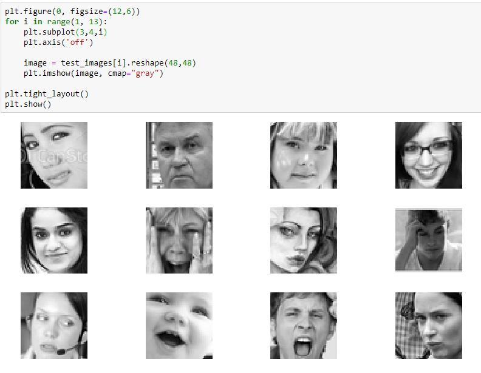
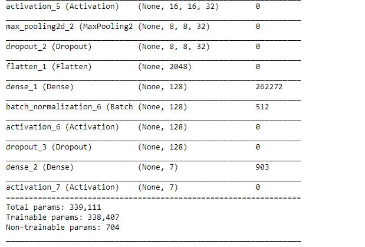
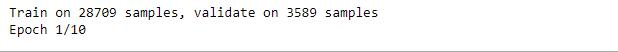
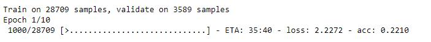
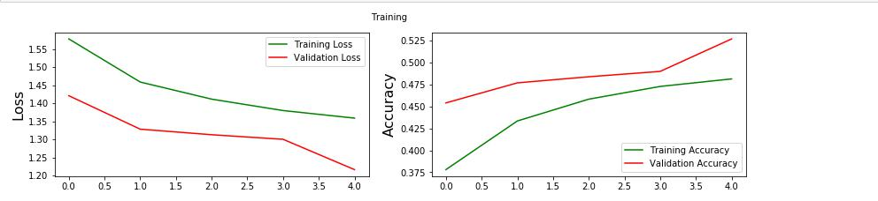

# Emotion-recognition

The data consists of 48x48 pixel grayscale images of faces. The faces have been automatically registered so that the face is more or less centered and occupies about the same amount of space in each image. The task is to categorize each face based on the emotion shown in the facial expression in to one of seven categories (0=Angry, 1=Disgust, 2=Fear, 3=Happy, 4=Sad, 5=Surprise, 6=Neutral).

train.csv contains two columns, "emotion" and "pixels". The "emotion" column contains a numeric code ranging from 0 to 6, inclusive, for the emotion that is present in the image. The "pixels" column contains a string surrounded in quotes for each image. The contents of this string a space-separated pixel values in row major order. test.csv contains only the "pixels" column and your task is to predict the emotion column.

The training set consists of 28,709 examples. The public test set used for the leaderboard consists of 3,589 examples. The final test set, which was used to determine the winner of the competition, consists of another 3,589 examples.

This dataset was prepared by Pierre-Luc Carrier and Aaron Courville, as part of an ongoing research project. They have graciously provided the workshop organizers with a preliminary version of their dataset to use for this contest.

https://www.kaggle.com/c/challenges-in-representation-learning-facial-expression-recognition-challenge/data
 
# Installations:

**Note: Python 2.x is not supported**

-keras

-tensorflow-gpu

-opencv-contrib

-numpy

-PyQt5

 
# Usage:

The program will creat a gui to display the scene capture by webcamera and a window representing the probabilities of detected emotions.

> Run

python emotion.py

 
# Dataset:

Dataset [install from kaggle](https://www.kaggle.com/c/challenges-in-representation-learning-facial-expression-recognition-challenge/data) 

# Training and Test #

Read dataset (csv file)

  

----------
28709 training image in Dataset

  

> 
  

> 
 
  

----------

3589 test image in Dataset

  

> 
  

## create Convolutional Neural Network Keras (CNN) ##

> 
  

> 
  

----------

- > 
  

Loss graphics

  

- If you have an Nvidia GPU, then you can install `tensorflow-gpu` package. It will make things run a lot faster.
Depending on the hardware configuration of your system, the execution time will vary. On CPU, training will be slow. Please use onlu tensorflow-gpu(Cuda Toolkit and CudNN).

## Help
If any issues and suggestions to me, you can create an  [issue](https://github.com/RashadGarayev/PyEmotionRecognition/issues) or reach out on Facebook [Rashad Garayev](https://www.facebook.com/fly.trion) .

